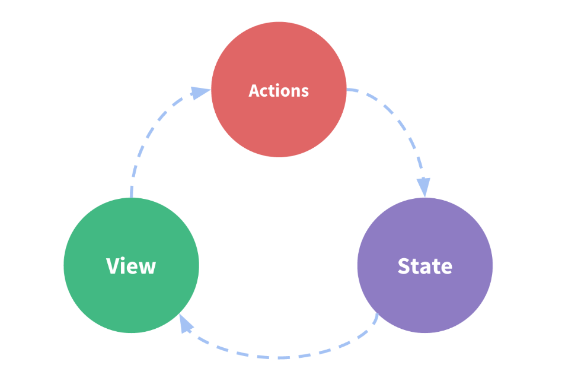

_Okay, where do we start then? I thought best place to start learning Redux would be the docs._

# Part 1

[Redux Essentials: Redux Overview and Concepts](https://redux.js.org/tutorials/essentials/part-1-overview-concepts)

### What is Redux, anyway?

> Redux is a pattern and library for managing and updating application state, using events called "actions".

It helps us to manage the state of our app or website.

### Why Should I Use Redux?

Redux helps to manage the global state = state that is needed across many parts of your application.

The patterns and tools provided by Redux make it easieri to understand when, where, why and how the state in your application is being updated, and how your application login will behave when those changes occur.

Predictable and Testable

## Redux Terms and Concepts

### State Management

- The **state**, the source of truth that drives our app;
- The **view**, a declarative description of the UI based on the current state
- The **actions**, the events that occur in the app based on user input, and trigger updates in the state



### Immutability

"Mutable" means "changeable". If something is immutable it can never be changed.

**In order to update values immutably, your code must make copies of existing objects/arrays, and then modify the copies.**

**Redux expects that all state updates are done immutably.**

## Terminology

### Actions

An action is plain JavaScript object that has a type field. **You can think of an action as an event that describes something that happened in the application.**

An example of a typical action object:

```javascript
const addTodoAction = {
  type: "todos/todoAdded",
  payload: "Buy milk",
};
```

### Action Creators

An actions creator is function that creates and returns an action object. We typically use these so we don't have to write the action object by hand every time.
